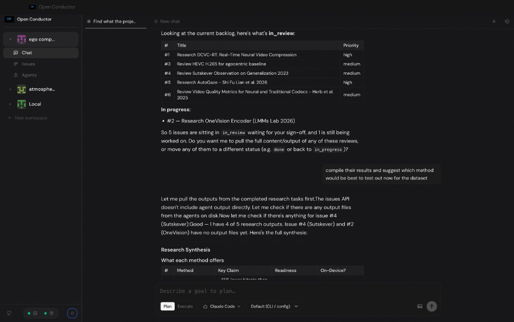
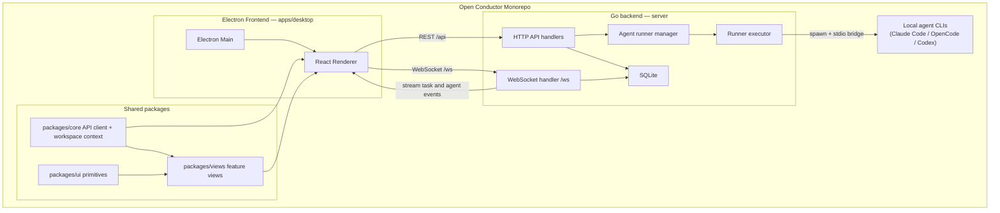

# Open Conductor

Open Conductor is a desktop app for managed local agent swarms.



## Repository layout

| Path | Role |
|------|------|
| `apps/desktop` | Electron + React UI (issues, agents, connect/disconnect/reconnect) |
| `server` | HTTP/WebSocket API, task queue, agent runners |
| `packages/core` | Shared API client, React Query, workspace context |
| `packages/views` | Feature views consumed by the desktop app |
| `packages/ui` | Shared UI primitives |
| `apps/web`, `apps/docs` | Optional Next.js apps (not required for the main product) |

Monorepo tooling: **pnpm**, **Turbo**, **TypeScript**.

## Architecture



## Prerequisites

- **Node.js** ≥ 18, **pnpm** 9
- **Go** 1.22+
- Optional: **Claude Code**, **OpenCode**, and/or **Codex** on `PATH` for agent features

## Quick start

### 1. Database

Copy the environment file. By default `DATABASE_URL` points at a **SQLite** file in the repo root:

```sh
cp .env.example .env
# Optional: change the path in DATABASE_URL
```

### 2. Migrations

From the `server` directory (with `DATABASE_URL` set, e.g. via `.env` in repo root):

```sh
cd server
go run ./cmd/migrate
```

### 3. API server

```sh
cd server
go run ./cmd/server
```

Default listen address: `http://localhost:8080` (override with `PORT`).

### 4. Desktop app

In a second terminal, from the **repository root**:

```sh
pnpm install
pnpm exec turbo dev --filter=@open-conductor/desktop
```

The renderer is configured to use `http://localhost:8080` for the API and `ws://localhost:8080/ws` for WebSockets (see `apps/desktop/src/renderer/src/App.tsx`). Start the Go server before the UI.

## Environment variables

| Variable | Required | Description |
|----------|----------|-------------|
| `DATABASE_URL` | Yes | SQLite DSN, e.g. `file:./open_conductor.db` (see `internal/sqliteutil`) |
| `PORT` | No | HTTP port (default `8080`) |
| `JWT_SECRET` | No | JWT signing for auth routes |
| `CORS_ORIGIN` | No | CORS allowlist for browser clients |
| `OPENCODE_PATH` | No | Absolute path or name on `PATH` for the OpenCode binary (see also `MULTICA_OPENCODE_PATH` for compatibility) |

See `.env.example` for a template.

## Agents

- **Discover**: `GET /api/detect-agents` lists CLIs found on the host.
- **Connect**: Creates an agent record and calls `POST /api/daemon/register` to start the in-process **runner** for that agent.
- **Disconnect / reconnect**: `POST /api/workspaces/{workspaceId}/agents/{agentId}/disconnect` and `.../reconnect` (workspace-scoped).
- **OpenCode**: Config is read from `XDG_CONFIG_HOME/opencode/opencode.json` or `~/.config/opencode/opencode.json`. If no local API `baseURL` is set, discovery treats the install as available without probing a bogus `/models` URL.

## Scripts (root)

```sh
pnpm build          # turbo build
pnpm dev            # turbo dev (all packages that define dev)
pnpm lint           # turbo lint
pnpm check-types    # turbo check-types
```

## Tests (Go)

```sh
cd server
go test ./...
```

Live CLI **integration** pings (Claude / Codex) are opt-in:

```sh
INTEGRATION_AGENT=1 go test ./pkg/agent/... -run 'Integration.*Ping' -timeout=10m -v
```
